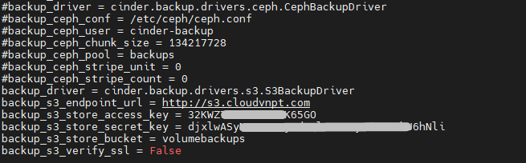
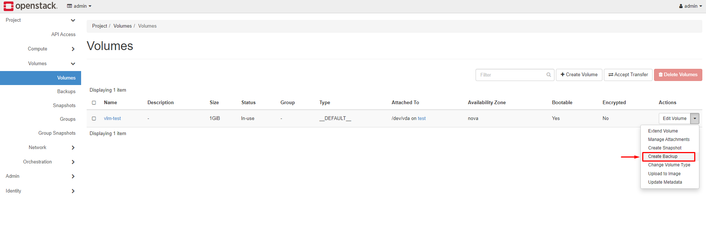
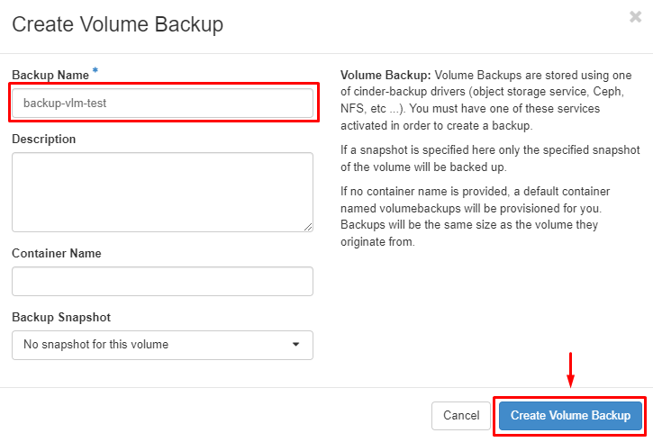
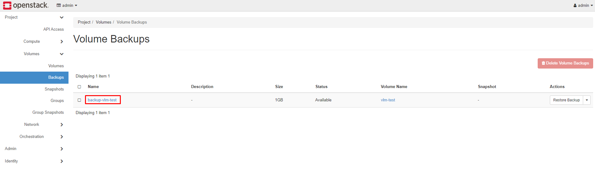
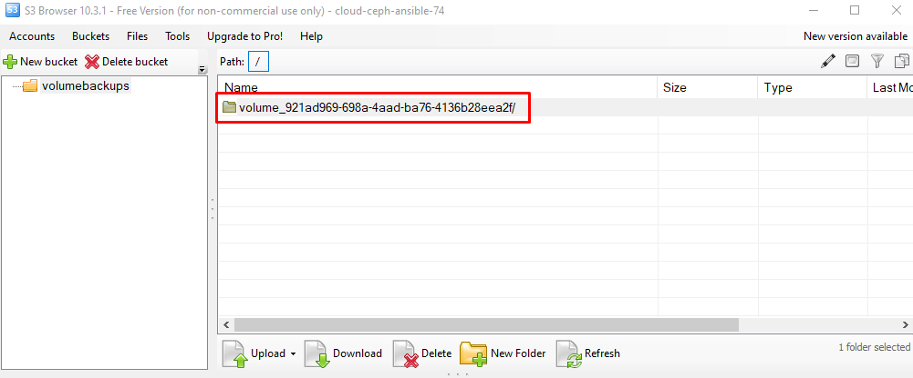
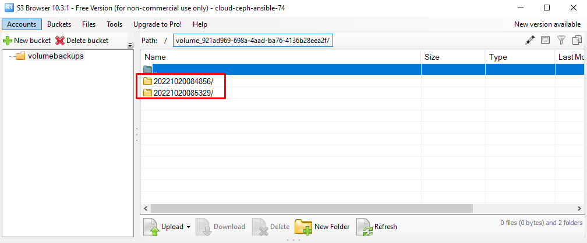
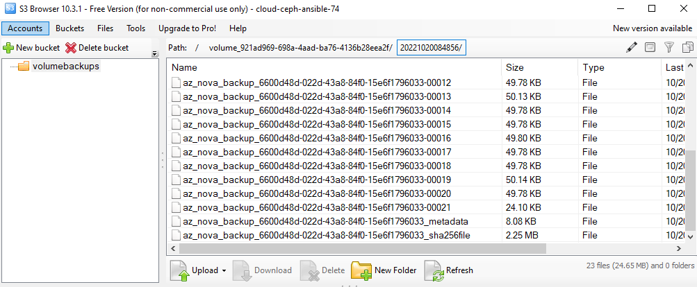

# Cấu hình Cinder backup sử dụng backend S3 Storage

- Phiên bản OpenStack sử dụng trong bài viết: Yoga
- Cách triển khai OpenStack: Sử dụng Kolla-Ansible

## Cấu hình trên node Controller
Chỉnh sửa file cấu hình cinder backup. Tại bài viết này, đường dẫn file sẽ là:
```
/etc/kolla/cinder-backup/cinder.conf
```

Comment các dòng cấu hình liên quan tới backup.



Thực hiện thêm các dòng cấu hình backup sử dụng S3 Storage tương tự dưới đây:
```
backup_driver = cinder.backup.drivers.s3.S3BackupDriver
backup_s3_endpoint_url = http://s3.cloudvnpt.com
backup_s3_store_access_key = 32KWZ.............65GO
backup_s3_store_secret_key = djxlwASy.................GPhU6hNli
backup_s3_store_bucket = volumebackups
backup_s3_verify_ssl = False
```

Lưu lại, thực hiện restart service cinder backup.
```
docker restart cinder_backup
```

## Thực hiện backup volume
Thực hiện Create Backup volume cần backup:





Ta sẽ thấy bản backup được tạo:



Kiểm tra bản backup được lưu trữ trên S3:



- Các bản backup của 1 volume sẽ được lưu trữ trong 1 thư mục có dạng `volume_<id_volume>`
- Các bản backup sẽ được lưu với mốc thời gian thực hiện backup:
    

- Các object trong phần backup của volume:
    

## Backup sử dụng openstack CLI
Câu lệnh backup volume:
```
openstack volume backup create --name <backup_name> [--incremental] [--force] <id_volume>
```
- `--incremental` : tùy chọn này sử dụng khi muốn backup incremental. Yêu cầu: Đã có 1 bản backup full của volume.
- `--force` : sử dụng khi muốn backup volume ở cả trạng thái `available` và `in-use`.
- `id_volume`: id của volume cần thực hiện backup.

# Tham khảo:
- https://docs.openstack.org/cinder/latest/configuration/block-storage/backup/s3-backup-driver.html
- https://docs.openstack.org/cinder/latest/admin/volume-backups.html