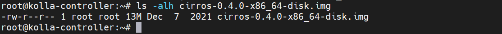
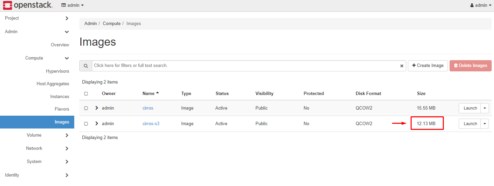

# Cấu hình S3 Storage làm backend lưu image cho Glance

Các bước này thực hiện với OPS được thử nghiệm với bản OpenStack Xena và Yoga. 

Môi trường:
- OpenStack Yoga thiết lập với Kolla Ansible.
- Ceph Object Gateway làm S3 Storage.

# Chuẩn bị S3-Storage
Chuẩn bị 1 môi trường S3 Storage. Tại đây, ta sử dụng Ceph S3. Đảm bảo OpenStack có thể truy xuất tới S3 Storage này.

Ta tạo 1 user trên Ceph S3 với endpoint trong bài này là: `http://192.168.60.71`
- user: `glance`
- Access key: `<access_key>`
- Secret key: `<secret_key>`

Khởi tạo 1 bucket tên `glance-storage`.

# Cấu hình Glance
Cấu hình file config `glance-api.conf`. Tại đây sử dụng Kolla Ansible, file cấu hình sẽ có vị trí: `/etc/kolla/glance-api/glance-api.conf`

Tại `[DEFAULT]`, chỉnh sửa dòng cấu hình:
```
enabled_backends = file:file, test:s3
```
Thêm cấu hình với định dạng `<tên backend>:s3`

Thêm đoạn cấu hình sau với tên backend đã đặt ở trên:
```conf
[test]
s3_store_host = http://192.168.60.71
s3_store_access_key = <access_key>
s3_store_secret_key = <secret_key>
s3_store_bucket = glance-storage
```

Chỉnh sửa cấu hình `[glance_store]`
```
[glance_store]
stores = file, test
default_backend = file
```
Trong đó:
- `stores`: các backend có thể sử dụng để lưu trữ image.
- `default_backend`: backend mặc định khi bạn upload image vào OpenStack.

Thực hiện restart glance API. Trong bài này sử dụng Kolla Ansible nên ta thực hiện restart container của Glance API:
```
docker restart glance_api
```

# Tạo image lưu trữ trên S3 Storage
**Các bước thực hiện:**
- Tạo 1 image trên OpenStack: Không chỉ định file trong bước tạo image. Nếu chỉ định file image trong lúc tạo thì image sẽ lưu trữ tại default backend đã cấu hình trong `glance-api.conf`
- Sử dụng API để đẩy data image vào image vừa khởi tạo.

## 1. Khởi tạo 1 image trên OpenStack
Ví dụ, ta tạo 1 image cirros với tên `cirros-s3`
```
openstack image create "cirros-s3" --disk-format qcow2 --container-format bare --public --insecure
```
Output:
```
+------------------+-----------------------------------------------------------------------------------------------------------------------------------------------+
| Field            | Value                                                                                                                                         |
+------------------+-----------------------------------------------------------------------------------------------------------------------------------------------+
| container_format | bare                                                                                                                                          |
| created_at       | 2022-09-21T03:27:15Z                                                                                                                          |
| disk_format      | qcow2                                                                                                                                         |
| file             | /v2/images/eaa7d682-e98f-47c2-b740-83aaee75b711/file                                                                                          |
| id               | eaa7d682-e98f-47c2-b740-83aaee75b711                                                                                                          |
| min_disk         | 0                                                                                                                                             |
| min_ram          | 0                                                                                                                                             |
| name             | cirros-s3                                                                                                                                     |
| owner            | b7cbab6af14d434db767bc0a87e46369                                                                                                              |
| properties       | os_hidden='False', owner_specified.openstack.md5='', owner_specified.openstack.object='images/cirros-s3', owner_specified.openstack.sha256='' |
| protected        | False                                                                                                                                         |
| schema           | /v2/schemas/image                                                                                                                             |
| status           | queued                                                                                                                                        |
| tags             |                                                                                                                                               |
| updated_at       | 2022-09-21T03:27:15Z                                                                                                                          |
| visibility       | public                                                                                                                                        |
+------------------+-----------------------------------------------------------------------------------------------------------------------------------------------+
```

Ta sẽ lưu ý các thông tin sau để sử dụng API upload data cho image:
```
file             | /v2/images/eaa7d682-e98f-47c2-b740-83aaee75b711/file
name             | cirros-s3 
status           | queued
```

Khi đó, trên Horizon sẽ thấy image đang ở trạng thái `queued` tương tự như hình:


## 2. Upload data image
Ta sẽ sử dụng API upload image:
```
curl -i -X PUT -H "X-Auth-Token: $token" \
   -H "X-Image-Meta-Store: {store_identifier}" \
   -H "Content-Type: application/octet-stream" \
   -d @/home/glance/ubuntu-12.10.qcow2 \
   $image_url/v2/images/{image_id}/file
```

**Trong đó:**
- `X-Auth-Token`: token xác thực
- `X-Image-Meta-Store`: tên backend lưu image
- `-d` : đường dẫn file image
- `$image_url` : endpoint API image service
- `/v2/images/{image_id}/file` : thông tin `file` đã lưu ở trên

**Lưu ý:** Trước khi put data vào image thì phải đảm bảo các điều sau:
- Image phải tồn tại và đang ở trạng thái `queued`
- Phải thiêt lập sẵn các thông tin về disk và container format cho image
- Dung lượng storage chứa image phải đủ dung lượng
- Kích thước image không được vượt quá dung lượng mà OpenStack image cho phép.


Lấy Token:
```
openstack token issue
```
Output:
```

+------------+-----------------------------------------------------------------------------------------------------------------------------------------------------------------------------------------+
| Field      | Value                                                                                                                                                                                   |
+------------+-----------------------------------------------------------------------------------------------------------------------------------------------------------------------------------------+
| expires    | 2022-09-22T03:38:34+0000                                                                                                                                                                |
| id         | gAAAAABjKoc6mBoON-aZrke1b4cvz0P-LaEeIVucldsYRoyQVfzc_0y9Tb9uS7mwP6t7J8ptRW08Xp5GO1nCKpQUIYbvpH_RUMylT-Rzuerv3Lih3ntz7vqKzZhlNWeIoiw4XGprLyfqdf0UL-3V6FtpgctV1k3LK25TEZ1szxvMBwmpwkFv19Y |
| project_id | b7cbab6af14d434db767bc0a87e46369                                                                                                                                                        |
| user_id    | ad30291a71074cee9b63fced7c6c8701                                                                                                                                                        |
+------------+-----------------------------------------------------------------------------------------------------------------------------------------------------------------------------------------+
```

### 2.1. Sử dụng lệnh curl
#### **Theo docs:** 
Mô tả lỗi gặp phải: Làm theo docs sẽ sử dụng option `-d` với lệnh `curl` để upload image. Tuy nhiên, gặp phải một lỗi như dưới đây

Upload image cirros:
```
curl -i -k -X PUT -H "X-Auth-Token: gAAAAABjKoc6mBoON-aZrke1b4cvz0P-LaEeIVucldsYRoyQVfzc_0y9Tb9uS7mwP6t7J8ptRW08Xp5GO1nCKpQUIYbvpH_RUMylT-Rzuerv3Lih3ntz7vqKzZhlNWeIoiw4XGprLyfqdf0UL-3V6FtpgctV1k3LK25TEZ1szxvMBwmpwkFv19Y" \
   -H "X-Image-Meta-Store: test" \
   -H "Content-Type: application/octet-stream" \
   -d @/root/cirros-0.4.0-x86_64-disk.img \
   https://192.168.60.65:9292/v2/images/eaa7d682-e98f-47c2-b740-83aaee75b711/file
```
Output:
```
HTTP/1.1 100 Continue

HTTP/1.1 204 No Content
content-type: text/html; charset=UTF-8
content-length: 0
x-openstack-request-id: req-ec2ccdfa-87a8-495c-969c-c298c87e0fcc
date: Wed, 21 Sep 2022 03:39:43 GMT
```

Tuy nhiên sẽ gặp tình huống dung lượng image được upload lên không bằng dung lượng file image -> dẫn đến tình trạng image lỗi và không boot được máy ảo.

Dung lượng của image hiển thị trên Horizon:
    

Dung lượng thực tế của image:
    

Dung lượng của image lưu trên S3 Storage:
    

#### **Fix**
Thay vì sử dụng option `-d`, mình sử dụng option `--data-binary`

Ví dụ:
```
curl -i -k -X PUT -H "X-Auth-Token: gAAAAABjKoc6mBoON-aZrke1b4cvz0P-LaEeIVucldsYRoyQVfzc_0y9Tb9uS7mwP6t7J8ptRW08Xp5GO1nCKpQUIYbvpH_RUMylT-Rzuerv3Lih3ntz7vqKzZhlNWeIoiw4XGprLyfqdf0UL-3V6FtpgctV1k3LK25TEZ1szxvMBwmpwkFv19Y" \
   -H "X-Image-Meta-Store: test" \
   -H "Content-Type: application/octet-stream" \
   -d @/root/cirros-0.4.0-x86_64-disk.img \
   https://192.168.60.65:9292/v2/images/eaa7d682-e98f-47c2-b740-83aaee75b711/file
```

Khi đó image upload với đủ dung lượng của image.


### 2.2. Sử dụng gọi API qua Postman
Xem thêm phần [API OpenStack](..\API-OPS\README.md)

#### **Lấy token dạng scoped authorization:**
Endpoint: 
```
POST >> https://192.168.60.65:5000/v3/auth/tokens
```
Body:
```json
{
   "auth": {
       "identity": {
           "methods": [
               "password"
           ],
           "password": {
               "user": {
                   "id": "ad30291a71074cee9b63fced7c6c8701",
                   "password": "GkOdPOy9kM8NPnVDP79VizmsbzMyhSSmkdNjyNvr"
               }
           }
       },
       "scope": {
           "project": {
               "id": "b7cbab6af14d434db767bc0a87e46369"
           }
       }
   }
}
```


#### **Tạo image: (có thể tạo bằng lệnh hoặc API)**
```
openstack image create "cirros-s3" --disk-format qcow2 --container-format bare --public --insecure
```
Output:
```
+------------------+-----------------------------------------------------------------------------------------------------------------------------------------------+
| Field            | Value                                                                                                                                         |
+------------------+-----------------------------------------------------------------------------------------------------------------------------------------------+
| container_format | bare                                                                                                                                          |
| created_at       | 2022-09-21T03:55:02Z                                                                                                                          |
| disk_format      | qcow2                                                                                                                                         |
| file             | /v2/images/5d45c606-1298-4d95-986b-40012b83cd9a/file                                                                                          |
| id               | 5d45c606-1298-4d95-986b-40012b83cd9a                                                                                                          |
| min_disk         | 0                                                                                                                                             |
| min_ram          | 0                                                                                                                                             |
| name             | cirros-s3                                                                                                                                     |
| owner            | b7cbab6af14d434db767bc0a87e46369                                                                                                              |
| properties       | os_hidden='False', owner_specified.openstack.md5='', owner_specified.openstack.object='images/cirros-s3', owner_specified.openstack.sha256='' |
| protected        | False                                                                                                                                         |
| schema           | /v2/schemas/image                                                                                                                             |
| status           | queued                                                                                                                                        |
| tags             |                                                                                                                                               |
| updated_at       | 2022-09-21T03:55:02Z                                                                                                                          |
| visibility       | public                                                                                                                                        |
+------------------+-----------------------------------------------------------------------------------------------------------------------------------------------+
```

#### **Upload data image:**
Endpoint:
```
PUT >> https://192.168.60.65:9292/v2/images/5d45c606-1298-4d95-986b-40012b83cd9a/file
```

Header: chứa thông tin Token, tên backend


Body: chứa đường dẫn hoặc file image


Kết quả:


Image hiển thị trên Horizon:


Dung lượng file lưu trong backend S3 Storage:


Boot máy ảo từ image lưu trên S3 Storage:


## Tham khảo:
- [Link OpenStack](https://docs.openstack.org/api-ref/image/v2/index.html?expanded=create-image-detail,show-tasks-associated-with-image-detail,queue-image-detail,query-cache-status-detail,list-stores-detail,import-an-image-detail,stage-binary-image-data-detail,show-image-detail,list-images-detail,update-image-detail,delete-image-detail,deactivate-image-detail,reactivate-image-detail,create-image-member-detail,show-image-member-details-detail,list-image-members-detail,update-image-member-detail,delete-image-member-detail,add-image-tag-detail,delete-image-tag-detail,show-images-schema-detail,show-image-schema-detail,show-image-members-schema-detail,show-image-member-schema-detail,upload-binary-image-data-detail,download-binary-image-data-detail,delete-image-from-store-detail,import-methods-and-values-discovery-detail,quota-usage-detail,list-stores-detail-detail,create-task-detail,list-tasks-detail,show-task-details-detail,show-tasks-schema-detail,show-task-schema-detail,delete-image-from-cache-detail,clear-images-from-cache-detail#upload-binary-image-data)
- https://docs.openstack.org/glance/latest/admin/multistores.html